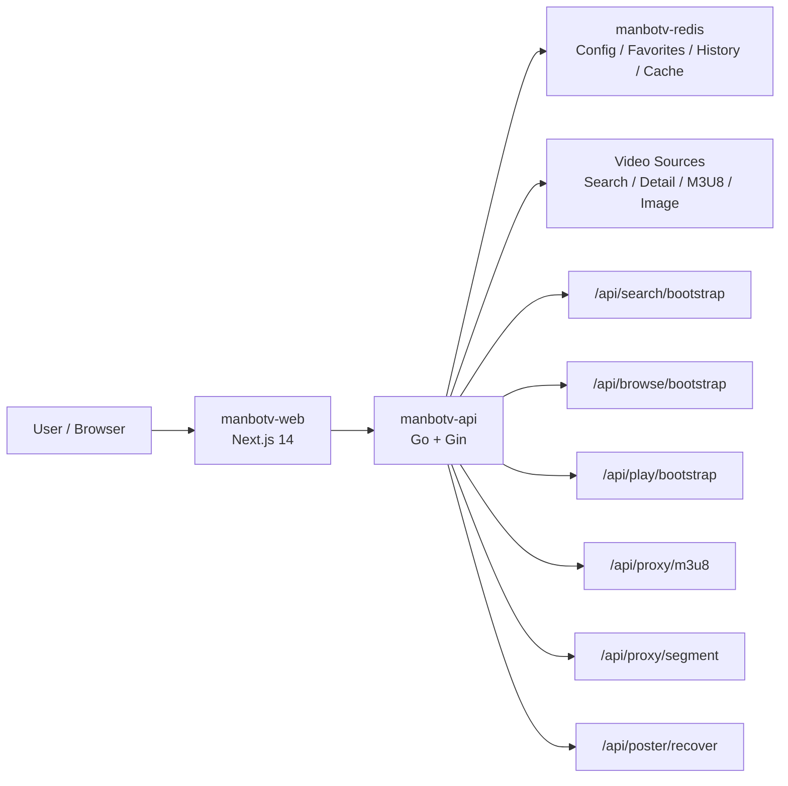

<div align="center">
  
  <h1>ManboTV</h1>
  <p><strong>面向 Docker / NAS / OpenWRT 的影视聚合前后端分离版本</strong></p>
  <p>Next.js 14 + Go + Gin + Redis · 多源聚合 · HLS 代理 · 图片恢复 · Docker 部署</p>

  
  
  
  
  
  
</div>

---

## ✨ 简介

ManboTV 是基于 MoonTV 思路继续重构的版本，核心目标很直接：

- 把搜索、详情、图片代理、播放代理这些重链路从前端拆出来
- 用 Go 后端承接多源并发、超时控制、代理转发和缓存
- 让项目更适合 Docker、自建机、NAS、OpenWRT 这种真实部署场景

这个版本不是简单换皮，重点放在两个词：**响应速度** 和 **长期可维护性**。

---

## 🗂️ 目录

- [重要声明](#-重要声明)
- [Highlights](#-highlights)
- [和旧版思路相比](#-和旧版思路相比)
- [项目截图](#-项目截图)
- [当前能力](#-当前能力)
- [架构图](#️-架构图)
- [快速开始](#-快速开始)
- [首次部署说明](#-首次部署说明)
- [Roadmap](#️-roadmap)
- [Known Issues](#-known-issues)
- [免责声明](#️-免责声明)
- [License](#-license)
- [致谢](#-致谢)

---

## ❗ 重要声明

- 本项目定位为自部署、自维护的影视聚合程序，不提供公共实例、托管服务或官方数据源分发。
- 项目本身不内置影视内容，相关搜索结果、封面、详情和播放链接可能来自用户配置或第三方公开接口。
- 第三方资源站存在失效、限流、封禁、返回异常数据甚至潜在合规风险，部署者应自行评估并承担后果。
- 如收到权利人通知，项目维护者或部署者应及时删除、屏蔽、断开相关链接或禁用对应数据源。
- 严禁在中国大陆法律管辖范围内传播、推广、镜像、分发、演示或商业化使用本项目，也严禁发布到中国大陆境内各类平台与社交平台。

---

## 🔥 Highlights

### ⚡ 更快的链路

- Go 后端更适合多源搜索、详情抓取、图片流和视频流这类高并发 I/O
- 搜索页、频道页、播放页都已经改成 bootstrap 聚合接口，前端不再自己串多次请求
- m3u8、segment、图片代理统一走后端，浏览器侧跨域、防盗链和散请求压力明显更小
- 海报恢复和封面换源在后端处理，前端不再反复兜底

### 🛡️ 更稳的播放与封面

- 候选源测速与自动切线，避免第一条线路挂掉就整页失效
- 图片代理带缓存、恢复和换源，黑图明显减少
- 默认部署自动注入可用视频源配置
- 内容模式、标签屏蔽、视频源管理都放进后台

### 🧱 更适合部署

- 标准 `docker compose` 三容器即可运行
- 前端、后端、Redis 职责清楚
- 本地、自建机、NAS、路由器部署方式一致
- 首次部署默认可搜、可看详情、可进播放页

### 🧠 为什么后端改成 Go

- `goroutine` 更适合做多源搜索和多站点并发抓取
- `context + timeout + connection reuse` 更容易把慢源、坏源、403 源隔离掉
- 图片和视频分片是流式转发场景，Go 在这类代理上比把逻辑堆在前端更直接
- 后端聚合后，前端页面逻辑更轻，交互延迟和状态撕裂都会少很多

---

## 📈 和旧版思路相比

| 维度 | 旧思路 | ManboTV 当前版本 |
| --- | --- | --- |
| 架构 | 前端偏一体化 | 前后端分离，Next.js + Go |
| 搜索 | 前端/单层逻辑容易拖慢首屏 | Go 并发聚合 + 超时控制 + 降级返回 |
| 播放首屏 | 前端自己串多次请求 | `/api/play/bootstrap` 一次返回核心数据 |
| 搜索页 | 结果、建议词、历史分散拉取 | `/api/search/bootstrap` 统一返回 |
| 频道页 | 前端多次请求再合并 | `/api/browse/bootstrap` 后端聚合 |
| 图片链路 | 容易黑图、占位图多 | 图片代理 + 海报恢复 + 缓存 |
| 播放容错 | 当前线路失败容易直接黑屏 | 候选源测试 + 自动切线 |
| 首次部署 | 经常是空壳 | 空配置自动注入默认视频源 |
| 后台能力 | 配置入口弱 | 视频源管理、内容模式、标签屏蔽 |
| 维护性 | 文件容易膨胀 | 模块拆分、接口分层、规则明确 |

---

## 🖼️ 项目截图

| 首页推荐流 | 电影频道 | 后台视频源 |
| --- | --- | --- |
|  |  |  |

---

## 🧩 当前能力

### 内容与页面

- 🔍 多源聚合搜索
- 🏠 首页内容流
- 🎬 电影 / 电视剧 / 综艺 / 动漫频道页
- 🧭 搜索结果聚合展示
- 📚 收藏、继续观看、搜索历史
- 🎛️ 后台管理页面

### 播放与代理

- ▶️ HLS 播放代理
- 🧱 segment 分片代理与 `Range` 支持
- 🔄 m3u8 内容重写
- 🛟 候选源测速与自动回退
- 🎯 `/api/play/bootstrap` 首屏聚合

### 图片与封面

- 🖼️ 统一图片代理
- 🩹 海报恢复接口 `/api/poster/recover`
- 🧠 Redis 缓存恢复结果
- 🔁 多图床容错与封面换源

### 后台与策略

- ⚙️ 视频源管理
- 🆕 默认源自动初始化
- 🔞 内容模式切换：`safe` / `mixed` / `adult_only`
- 🏷️ 标签屏蔽
- 👤 用户与基础权限配置

---

## 🏗️ 架构图



### 技术栈

- 前端：`Next.js 14`
- 后端：`Go + Gin`
- 存储：`Redis`
- 播放：`HLS.js + ArtPlayer`
- 部署：`Docker Compose`

### 服务组成

- `manbotv-web`
  - 前端页面服务
  - 默认端口 `3000`
- `manbotv-api`
  - 搜索、详情、代理、后台 API
  - 容器内端口 `8080`
- `manbotv-redis`
  - 管理配置、用户数据、播放记录、收藏、缓存

---

## ⚙️ 关键接口

- `/api/home`
- `/api/browse/bootstrap`
- `/api/search`
- `/api/search/bootstrap`
- `/api/detail`
- `/api/play/bootstrap`
- `/api/proxy/m3u8`
- `/api/proxy/segment`
- `/api/poster/recover`

---

## 🐳 快速开始

### 1. 准备环境

需要：

- Docker
- Docker Compose Plugin

检查命令：

```bash
docker --version
docker compose version
```

### 2. 配置环境变量

```bash
cp .env.example .env
```

至少确认这几个值：

```env
USERNAME=admin
PASSWORD=admin888
PORT=3000
```

说明：

- `USERNAME` / `PASSWORD`：站长账号
- `PORT`：前端对外暴露端口

示例文件：

- [.env.example](/Users/Zhuanz1/Desktop/project/ManboTv/.env.example)

### 3. 启动服务

```bash
docker compose up -d --build
```

查看状态：

```bash
docker compose ps
```

查看日志：

```bash
docker compose logs -f web
docker compose logs -f api
docker compose logs -f redis
```

### 4. 访问项目

- 登录页：[http://localhost:3000/login](http://localhost:3000/login)
- 默认后台账号：使用 `.env` 中配置的 `USERNAME` / `PASSWORD`

---

## 🪄 首次部署说明

当前版本和旧版最不一样的一点，是**新实例不再默认是空壳**。

现在的行为是：

- Redis 中没有管理员配置时
- 后端会自动写入默认视频源配置
- 新部署实例默认就可以搜索、看详情、进入播放页

这对下面这些场景很重要：

- NAS 部署
- 自建 Docker 宿主机
- OpenWRT 路由器部署
- 现场交付

需要说明的是：

- 数据源来自第三方站点
- 不同源的速度和稳定性会波动
- 某些源可能详情可用但首条线路失效
- 当前版本已经支持候选源回退，但第三方站点本身的不稳定无法完全消除

---

## 🛠️ 常用命令

重建并重启：

```bash
docker compose up -d --build
```

停止服务：

```bash
docker compose down
```

重启单个服务：

```bash
docker compose restart web
docker compose restart api
docker compose restart redis
```

进入容器：

```bash
docker compose exec web sh
docker compose exec api sh
docker compose exec redis redis-cli
```

---

## 💻 本地开发

安装并启动前端：

```bash
pnpm install
pnpm dev
```

前端检查：

```bash
pnpm typecheck
pnpm lint
```

后端测试：

```bash
cd backend
go test ./...
```

---

## 🗺️ Roadmap

- [x] Go 后端接管搜索、详情、代理链路
- [x] 搜索页 / 播放页 / 频道页 bootstrap 聚合
- [x] 海报恢复与图片代理容错
- [x] 播放候选源测速与自动回退
- [x] 默认视频源自动初始化
- [ ] 更完整的后台源质量评分与自动排序
- [ ] 更稳定的相关推荐与推荐流
- [ ] 更完善的订阅 / 配置同步机制
- [ ] 更细粒度的播放页按需测速策略

---

## 🧯 Known Issues

- 第三方资源站本身不稳定时，仍可能出现单源失效、限流、403、EOF 等问题
- 少数站点的封面图床有防盗链或失效情况，只能通过恢复和换源尽量补齐
- 不同部署环境的网络质量差异很大，播放体验会受本地带宽、DNS、线路影响
- 个别资源站的剧集数据格式不标准，仍需要持续做兼容处理

---

## 📚 相关文档

- [DOCKER.md](/Users/Zhuanz1/Desktop/project/ManboTv/DOCKER.md)
- [AGENTS.md](/Users/Zhuanz1/Desktop/project/ManboTv/AGENTS.md)
- [.codex/skills/refactor-moontv/SKILL.md](/Users/Zhuanz1/Desktop/project/ManboTv/.codex/skills/refactor-moontv/SKILL.md)

---

## ⚠️ 免责声明

本项目仅用于学习、研究与技术交流，不提供任何影视内容的制作、上传、存储或分发服务。

项目中涉及的搜索结果、封面、详情信息及播放链接，均来自用户自行配置或第三方公开接口。项目维护者不对相关内容的合法性、准确性、完整性、可用性作任何明示或默示担保。

任何单位或个人认为本项目相关功能、数据源或链接可能涉嫌侵犯其合法权益的，请及时提交权利通知及权属证明。项目维护者将在核实后尽快采取删除、屏蔽、断开链接、禁用相关数据源等必要措施。

请使用者在下载、缓存或访问相关内容后于 24 小时内自行删除，并确保其使用行为符合所在地法律法规。因使用第三方数据源所产生的任何法律责任，由使用者自行承担。

本项目明确禁止在中国大陆法律管辖范围内进行传播、推广、镜像、分发、演示或商业化使用；同时，明确禁止将本项目、相关部署实例、访问地址、演示内容或衍生版本发布、传播至中国大陆境内各类网络平台与社交平台，包括但不限于抖音、哔哩哔哩、小红书、微博、微信公众号、视频号、快手、知乎、百度贴吧等。任何使用者违反前述限制所产生的一切风险与责任，均由使用者自行承担。

---

## 📄 License

本仓库当前采用 [CC BY-NC-SA 4.0](/Users/Zhuanz1/Desktop/project/ManboTv/LICENSE) 许可协议。

这意味着：

- 允许在署名的前提下学习、修改和再分发
- 禁止将本项目直接用于商业用途
- 基于本项目修改后的衍生版本，需继续采用相同许可方式共享

如果你计划二次开发、公开分发或部署衍生版本，建议先完整阅读 [LICENSE](/Users/Zhuanz1/Desktop/project/ManboTv/LICENSE)。

---

## 🙏 致谢

- 感谢 MoonTV / LunaTV 早期思路提供的产品原型与交互参考
- 感谢 [Next.js](https://nextjs.org/)、[Gin](https://gin-gonic.com/)、[Redis](https://redis.io/)、[HLS.js](https://github.com/video-dev/hls.js)、[ArtPlayer](https://github.com/zhw2590582/ArtPlayer) 等开源项目提供的基础能力
- 感谢所有在自部署、重构、测试和问题反馈中提供帮助的使用者与贡献者
